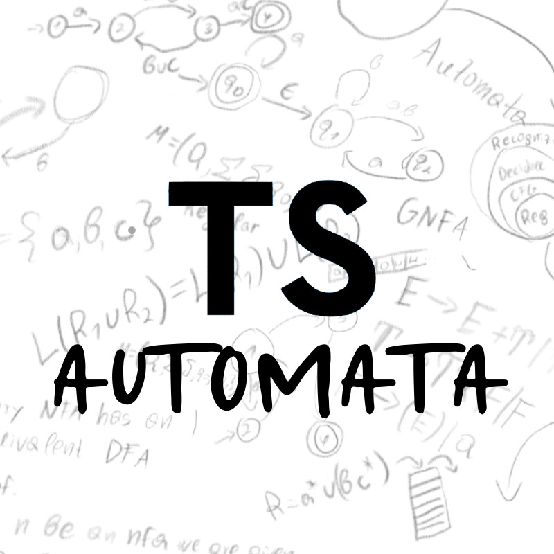

<p align="center">

</p>
<h1 align="center">
TS-Automata
</h1>
<p align="center">
A TypeScript/JavaScript library for managing automata.
<p>
<h6 align="center">

[](https://npmjs.org/package/ts-automata "View this project on npm")


</h6>


```shell
npm i ts-automata
```

> **Check out dnbln's Agda package for Automata proofs: [https://dnbln.dev/agdomaton ](https://dnbln.dev/agdomaton)**

## Overview

Currently supported are the Deterministic, Nondeterministic and Generalised nondeterministic finite state automata 
as well as nondeterministic push-down automata.

Make use of the provided TSDoc for insight on the methods. 


## Usage

Automata can be created by choosing an alphabet to feed to the Automaton,
defining the states of the automaton and finally the transition function. 
The code below is an example of creating and running input on a DFA.

```typescript
/* Initialize the DFA */
const dfa = new DFA("ab", "q0", false)

/* Add states to the DFA */
dfa.addState("q1", false);
dfa.addState("q2", true)

/* Define the transition function for each state */
dfa.addEdge("q0", 'b', "q0");
dfa.addEdge("q0", 'a', "q1");
dfa.addEdge("q1", 'a', "q2");
dfa.addEdge("q1", 'b', "q0");
dfa.addEdge("q2", 'a', "q2");
dfa.addEdge("q2", 'b', "q2");

/* Check for validity */
console.log(dfa.isValid());

/* Run strings on the DFA */
dfa.runString("ababababaa") // true
dfa.runString("aa") // true
dfa.runString("abb") // false
```
_Figure 1: The code for the deterministic finite automaton D._


_Figure 2: Visual representation of D._

This can also be done using the helpful `DFABuilder`:
```typescript
const dfa = new DFABuilder("ab")
    /* Add states to the DFA */
    .withNotFinalStates("q0", "q1")
    .withFinalStates("q2")

    /* Define the transition function for each state */
    .withEdges.from("q0").toSelf().over("b")
    .withEdges.from("q0").to("q1").over("a")
    .withEdges.from("q1").to("q2").over("a")
    .withEdges.from("q1").to("q0").over("b")
    .withEdges.from("q2").toSelf().over("ab")
    .getResult()
```
_Figure 3: Creating a DFA using a `DFABuilder`._

## Roadmap
_As of 27th June 2024_

1. Turing machine simulation
2. CFG simulation and parsing
3. WriterSide documentation
4. GUI (out of scope for this repo)

